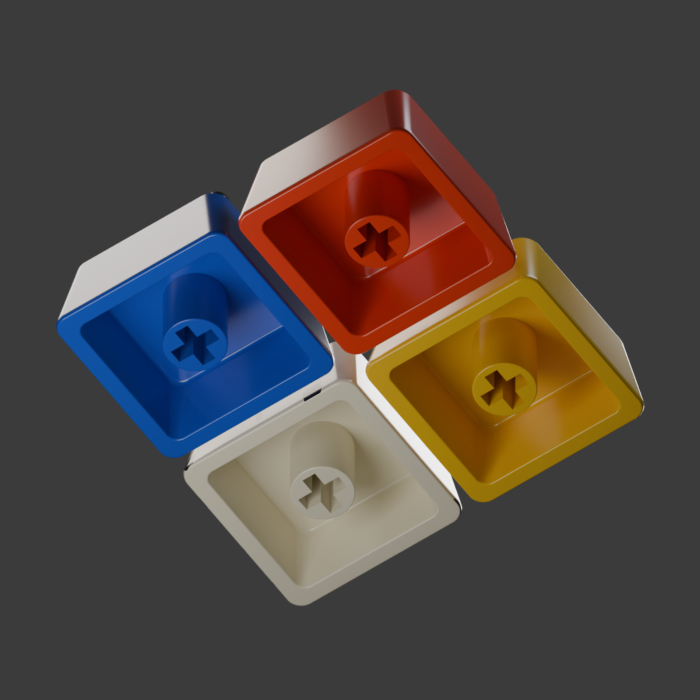

# Memphis Artisan Keycaps

A coordinated set of four Memphis-inspired artisan keycaps: bold colors, geometric relief, and soft glazed finishes for a keyboard’s isolated 2×2 navigation cluster.


## The set

- **Arch / porcelain + teal** — a dark teal arch with short straight terminals, an orange hemisphere, and Dalmatian-like black patches continuing over the cream base’s sides.
- **Zigzag / mustard + lilac** — a chunky black stepped beam and a low lilac cylinder, with tight spacing and small, square-ish corner radii.
- **Disc / cobalt** — a broad cream disc next to three rounded black rails reaching the deck’s right edge.
- **Stairs / vermilion + lilac** — a compact stair-shaped silhouette with one flat top, blocky corners, and room around its edges.

The models combine low relief, rounded shoulders, and subtle flared junctions for a glazed-ceramic impression. Colored parts remain separately editable.

## Open in Blender

Download or clone the repository, then open **[output/Memphis_Artisans.blend](output/Memphis_Artisans.blend)** in Blender 4.3 or newer.

```sh
git clone https://github.com/JaimeOrtegaxyz/artisans-memphis.git
cd artisans-memphis
```

Collections **01–04** contain one keycap each. Collection **05** contains the studio, lights, and cameras; hide it when inspecting or preparing model exports.

### Views

[Three-quarter render](output/Memphis_Artisans.png) · [Straight-down view](output/Memphis_Top.png) · [Underside render](output/Memphis_Underside.png)



## Dimensions and prototype status

| Feature | Nominal dimension |
| --- | --- |
| Switch-center pitch | 19.05 mm |
| Base footprint | 18 × 18 mm |
| Top deck | 15 × 15 mm |
| Deck height | Z = 9 mm |
| Main exterior wall draft | Approximately 8.6° |
| Highest point | Z = 11.5 mm |
| MX-style cross recess | 4.20 × 1.30 mm, 4.70 mm deep |

**These are design prototypes, not production-ready keycaps.** Socket fit, switch clearance, full travel, print shrinkage, and assembly tolerances have not been physically validated. Test-print a socket coupon before attempting a full set, and never force a tight socket onto a switch.

Individual component meshes pass the included manifold-edge and positive-volume checks. That does **not** establish that the intersecting assembly is ready for printing. Parts need appropriate union or assembly preparation before fabrication. The black porcelain patches are a procedural material, so they will not appear in an STL export.

See **[MODEL_NOTES.md](MODEL_NOTES.md)** for detailed dimensions, revision decisions, and fabrication guidance.

## Rebuild the scene

The generator uses Blender’s Python API; no MCP or third-party Python packages are required.

```sh
blender --background --python build_memphis.py
```

On macOS with Blender installed in Applications:

```sh
/Applications/Blender.app/Contents/MacOS/Blender --background --python build_memphis.py
```

For a quick 900 px preview:

```sh
MEMPHIS_DRAFT=1 blender --background --python build_memphis.py
```

**Rebuilding replaces the generated `.blend` and renders in `output/`.** Save manual edits elsewhere first. The script resets the scene, builds the models, saves the editable scene, and renders the three-quarter, top, and underside views.

### Check geometry

```sh
blender --background output/Memphis_Artisans.blend --python validate_memphis.py
```

This writes `output/Geometry_Check.json`, reporting non-manifold edges and signed volumes for each evaluated design mesh.

## Repository contents

```text
README.md                              Project overview
MODEL_NOTES.md                         Dimensions, revisions, fabrication guidance
artisans-memphis-creative-brief.md       Original written concept
artisans-memphis-render.png             Original visual reference
build_memphis.py                       Scene and render generator
validate_memphis.py                    Component topology audit
output/
  Memphis_Artisans.blend               Current editable Blender scene
  Memphis_Artisans.png                 Three-quarter render
  Memphis_Top.png                      Straight-down layout view
  Memphis_Underside.png                Underside inspection render
  Geometry_Check.json                 Geometry audit results
  v1/                                 First modeled iteration
  v2/                                 Second modeled iteration
```

The original creative brief is preserved as historical context; the current model incorporates later visual corrections, including the lilac cylinder and single-height staircase. Earlier scenes, renders, scripts, and notes are retained in `output/v1/` and `output/v2/`. Archived generators use paths relative to their own location; copy one to the project root before rebuilding that version.
