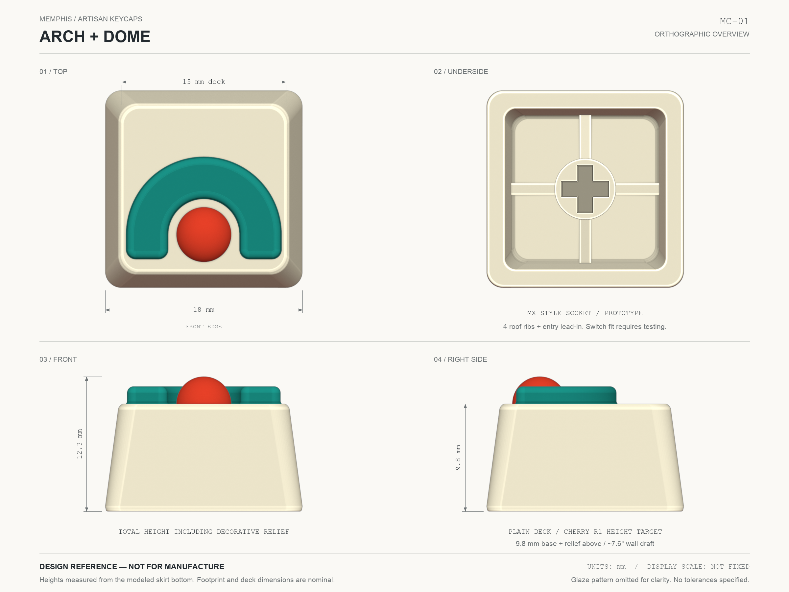

# Memphis Artisan Keycaps

Four Memphis-inspired artisan keycaps with editable Blender models, overview drawings, and single-material STL prototypes.


## The set

- **Arch / porcelain + teal** — concentric teal arch, orange hemisphere, and black patches wrapping around a cream base.
- **Zigzag / mustard + lilac** — a blocky black stepped beam beside a low lilac cylinder.
- **Disc / cobalt** — a cream disc and three rounded black rails reaching the deck’s edge.
- **Stairs / vermilion + lilac** — a compact, single-height staircase silhouette with room around its edges.

The **plain base is 9.8 mm tall**; the decoration sits above it. Each hollow base has a prototype MX-style socket, four permanent roof ribs, and a small insertion lead-in. This is a custom artisan profile informed by a GMK-based Cherry R1 reference—not an exact or certified GMK reproduction.

## Download and print

**Start with the plain-base fit test.** Check mounting, removal, full switch travel, neighboring-key clearance, and deck height on your keyboard before printing the decorated set.

| File | Purpose | Overall height |
| --- | --- | --- |
| [Base fit test](output/print/00_BASE_FIT_TEST.stl) | Undecorated base with socket and reinforcement | 9.8 mm |
| [Arch + dome](output/print/01_ARCH_DOME.stl) | Complete single-piece cap | 12.30 mm |
| [Zigzag + cylinder](output/print/02_ZIGZAG_CYLINDER.stl) | Complete single-piece cap | 11.45 mm |
| [Disc + rails](output/print/03_DISC_RAILS.stl) | Complete single-piece cap | 11.30 mm |
| [Stair silhouette](output/print/04_STAIR_SILHOUETTE.stl) | Complete single-piece cap | 11.45 mm |

STL coordinates are **millimeters**, centered in X/Y with the skirt bottom at Z = 0. Import at **100% scale** and check for an 18 × 18 mm footprint. Each export is a boolean-joined, single-component closed mesh; [Print_Check.json](output/print/Print_Check.json) records the topology audit.

**These remain test-print prototypes, not production-ready keycaps.** Watertight geometry does not establish switch fit, material strength, shrinkage compensation, or print orientation. Never force a tight socket onto a switch. The STL files have **no colors or black stain pattern**: paint a single-material print, or use the Blender scene to plan a separate multicolor process. Choose supports and orientation in your slicer; the internal ribs are structural parts, not removable print supports.

## Open and edit

Use Blender **4.3.2** (the tested version) to open [Memphis_Artisans.blend](output/Memphis_Artisans.blend). Newer Blender versions may work but are not guaranteed.

```sh
git clone https://github.com/JaimeOrtegaxyz/artisans-memphis.git
cd artisans-memphis
```

Collections **01–04** contain one cap each; **05** is the studio. Colored parts and structural pieces remain separately editable in the source scene. The STL exporter joins them without modifying the `.blend`.

[Top view](output/Memphis_Top.png) · [Underside render](output/Memphis_Underside.png) · [Dimensions and fabrication notes](MODEL_NOTES.md)

## Overview drawings

Each 2400 × 1800 PNG includes top, front, right-side, and underside views. Dimensions distinguish the plain base from total height including decoration.



[Arch + dome](output/drawings/01_ARCH_DOME.png) · [Zigzag + cylinder](output/drawings/02_ZIGZAG_CYLINDER.png) · [Disc + rails](output/drawings/03_DISC_RAILS.png) · [Stair silhouette](output/drawings/04_STAIR_SILHOUETTE.png)

These are **design references, not manufacturing drawings**. Glaze patterns are omitted; socket recesses use an illustrative darker tint. The images carry 300 DPI metadata, but their printed scale is not fixed.

## Dimensions

| Feature | Nominal value |
| --- | --- |
| Switch-center pitch | 19.05 mm |
| Skirt / deck | 18 × 18 / 15 × 15 mm |
| Plain base height | **9.8 mm**, excluding decoration |
| Main wall draft | Approximately 7.6° |
| Roof thickness | Approximately 1.85 mm |
| MX cross engagement | 4.20 × 1.30 mm; 4.70 mm total recess depth |
| Entry lead-in | 0.10 mm at 45° |
| Roof reinforcement | Four 1.10 mm nominal ribs |

The 9.8 mm height is a design target informed by owner measurements and [KeyV2’s GMK-based Cherry R1 definition](https://github.com/rsheldiii/KeyV2/blob/19f0d2faadd4949634c93f38d1a66869d29e8f43/src/key_profiles/cherry.scad). That reference includes stem-inset compensation; it is not a universal Cherry specification. See [MODEL_NOTES.md](MODEL_NOTES.md) for the mounting datums and fit caveats.

## Rebuild and verify

Requirements: Blender 4.3.2, Python 3.10+, and Pillow for drawing composition. No MCP is required. Install the drawing dependency in a virtual environment:

```sh
python3 -m venv .venv
. .venv/bin/activate
python -m pip install -r requirements.txt
```

With `blender` on your PATH:

```sh
blender -b --python build_memphis.py
blender -b output/Memphis_Artisans.blend --python validate_memphis.py
blender -b output/Memphis_Artisans.blend --python render_drawings.py
python compose_drawings.py
blender -b output/Memphis_Artisans.blend --python export_prints.py
python -m unittest discover -s tests -v
```

On macOS, substitute `/Applications/Blender.app/Contents/MacOS/Blender` for `blender`. On a headless Linux machine, run the drawing-render command under `xvfb-run -a` with Mesa/OpenGL available. Use `MEMPHIS_DRAFT=1 blender -b --python build_memphis.py` for faster 900 px preview renders.

**Rebuilding replaces generated outputs. Save manual edits elsewhere first.** Expected results are one editable scene, three renders, four drawing sheets, five STLs, and geometry/print audit reports. Geometry checks do not simulate switch travel or material strength.

## Project files

- `build_memphis.py` — model, materials, and render generator.
- `render_drawings.py` / `compose_drawings.py` — orthographic views and drawing sheets.
- `export_prints.py` — joined STL exports and print-mesh audit.
- `validate_memphis.py` / `tests/` — component, dimension, and release-asset checks.
- `output/` — Blender scene and renders; `drawings/` and `print/` contain the downloadable sheets and STLs.
- [Creative brief](artisans-memphis-creative-brief.md) · [Visual reference](artisans-memphis-render.png) · [Technical notes](MODEL_NOTES.md).

## Contributing and license

See [CONTRIBUTING](.github/CONTRIBUTING.md) for setup, validation, and fit-test reporting.

[MIT License](LICENSE). External tools, dependencies, and reference sources are documented in [THIRD_PARTY.md](.github/THIRD_PARTY.md). No affiliation with or endorsement by Cherry or GMK is implied.
